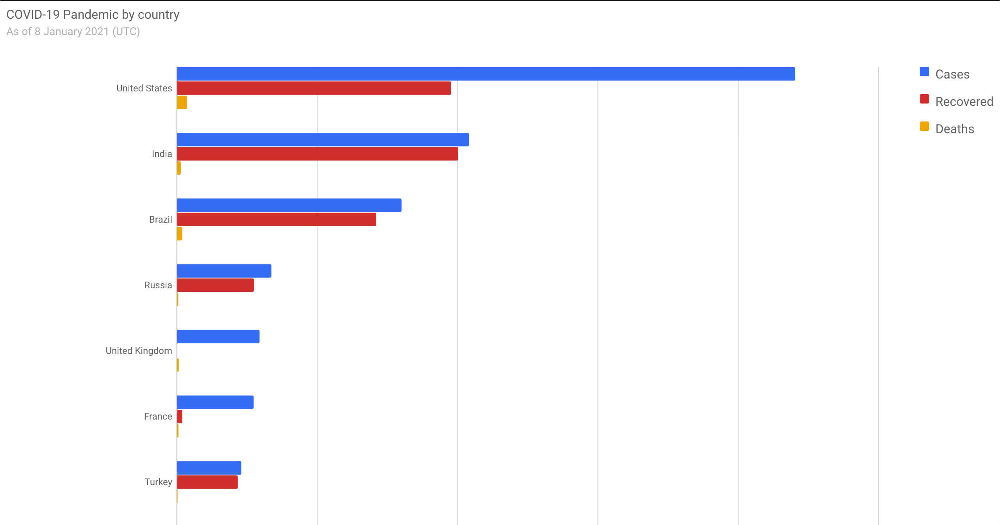

## Node.js Web Scraping using Puppeteer

A demonstration of scraping a Wikipedia table with COVID-19 data using Puppeteer and Node.js

## Install

```
npm install
```

## Usage

```
node scrape.js
```

```
node index.js
```

Open http://localhost:8000 in a browser.

